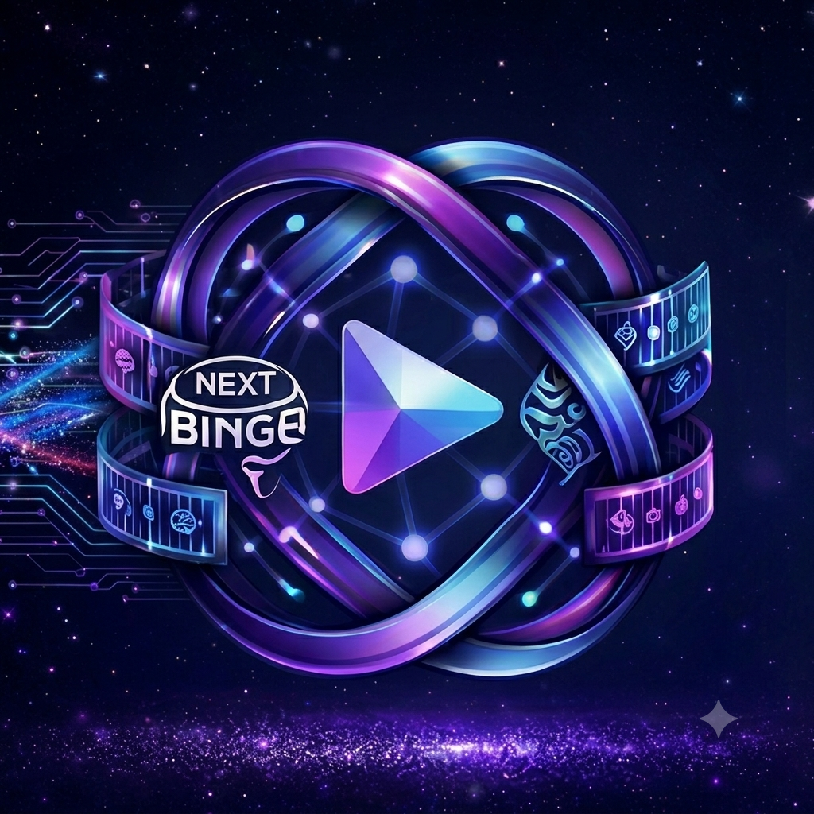
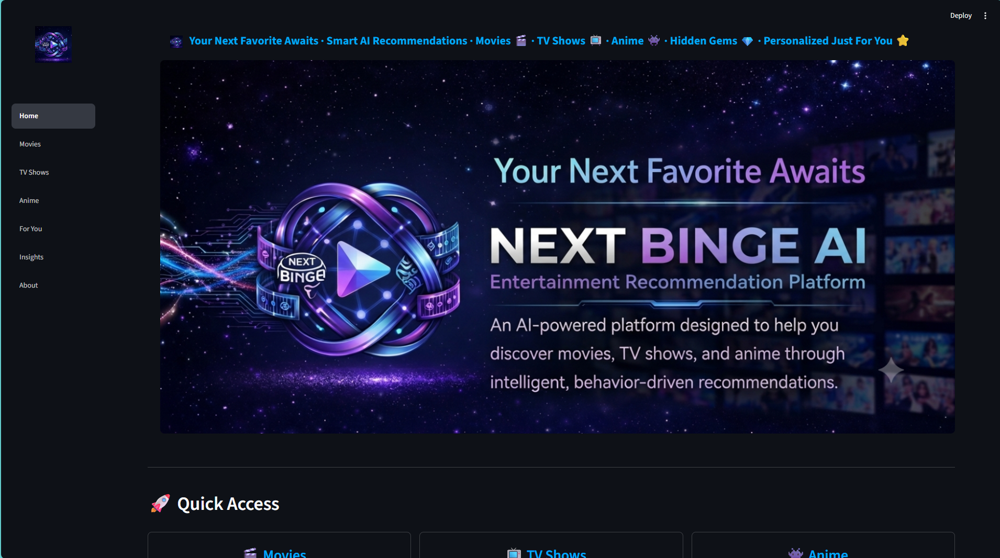
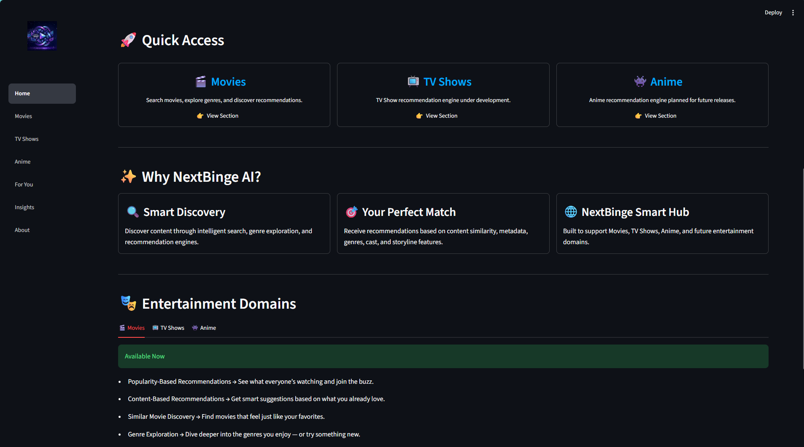
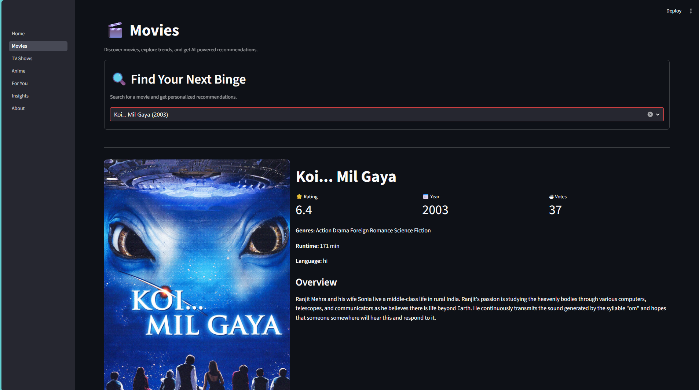
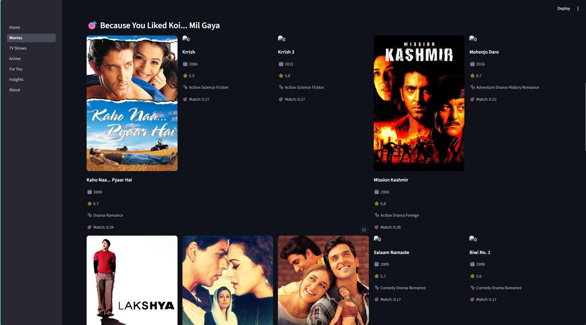
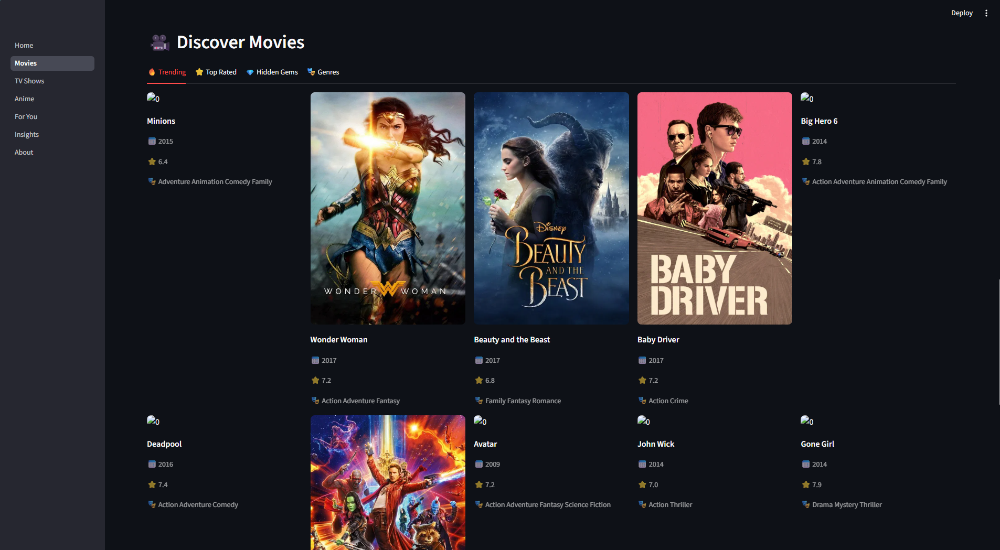
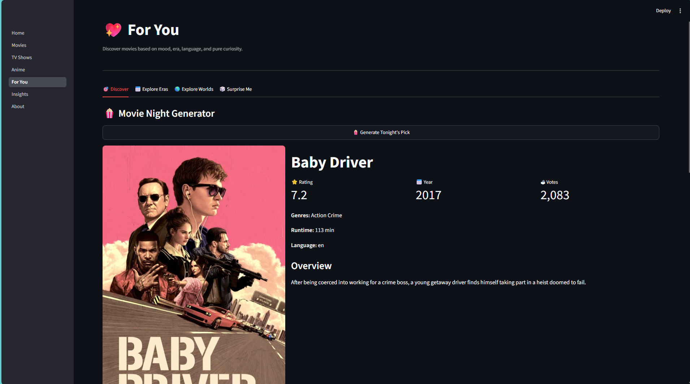
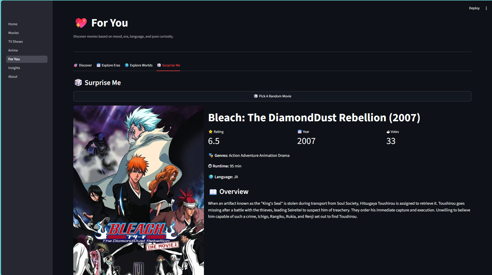
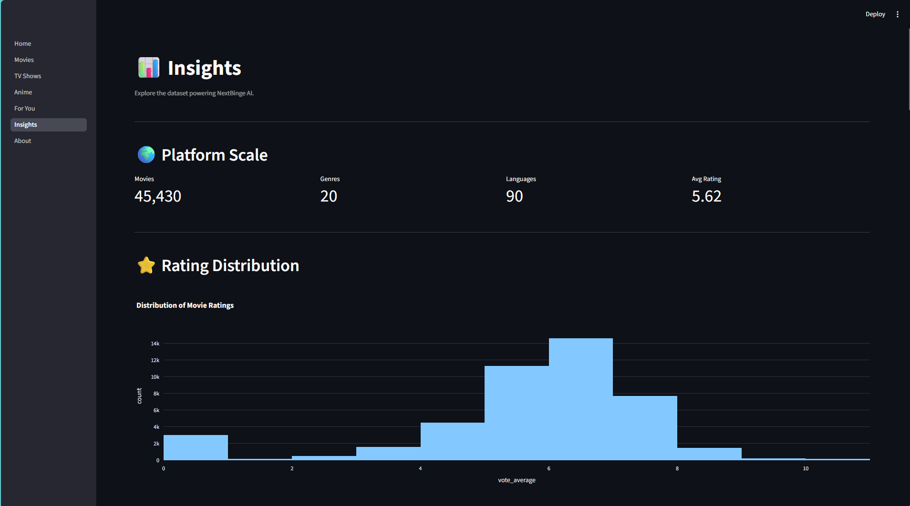
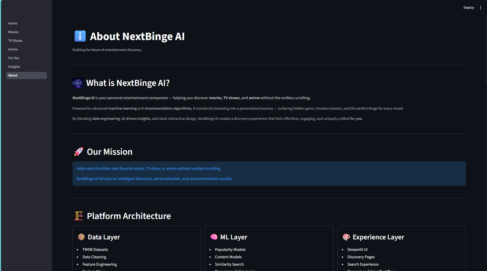

<h1 style="font-size:40px:">
      
      NextBinge AI
</h1>


**NextBinge AI** is an AI-powered entertainment recommendation platform designed to help users discover movies, TV shows, and anime through intelligent recommendation systems.

The platform currently supports movie recommendations using popularity-based and content-based recommendation techniques, with plans to expand into collaborative filtering, hybrid recommendation systems, TV shows, anime, and personalized user experiences.

---

## 🚀 Features

### 🎬 Movie Discovery

* Smart movie search with autocomplete
* Similar movie recommendations
* Trending movies
* Top-rated movies
* Hidden gems
* Genre-based exploration

### 🎯 For You

* Mood-based recommendations
* Quick Watch suggestions
* Decade Explorer
* Language Explorer
* Genre Roulette
* Movie Night Generator

### 📊 Insights

* Platform analytics
* Dataset statistics
* Recommendation engine overview
* Architecture visualization
* Product roadmap

---

## 🧠 Recommendation Engines

### 🔥 Popularity-Based Recommender

Ranks movies using:

* Ratings
* Vote counts
* Popularity signals
* Weighted ranking formulas

Examples:

* Trending Movies
* Top Rated Movies
* Hidden Gems

---

### 🎯 Content-Based Recommender

Recommends movies similar to a selected title using:

* Genres
* Keywords
* Cast
* Directors
* Movie descriptions

Powered by:

* TF-IDF Vectorization
* Cosine Similarity
* Metadata Feature Engineering

---

### 👥 Collaborative Filtering *(Planned)*

Future implementation:

* User ratings
* User similarity
* Matrix factorization
* Personalized recommendations

---

### ⚡ Hybrid Recommender *(Planned)*

Combines:

* Popularity signals
* Content similarity
* Collaborative filtering

To create highly personalized recommendations.

---

## 🏗️ Architecture

Data Layer

```text
TMDB Dataset
      │
      ▼
Data Cleaning
      │
      ▼
Feature Engineering
      │
      ▼
Movie Feature Store
```

Recommendation Layer

```text
Popularity Engine
Content Engine
Future Collaborative Engine
Future Hybrid Engine
```

Application Layer

```text
Streamlit UI
Movie Discovery
Search Experience
Recommendation Workflows
Analytics Dashboard
```

---

## 📂 Project Structure

```text
nextbinge-ai/
│
├── app/
│   ├── assets/
│   ├── components/
│   ├── pages/
│   └── Home.py
│
├── data/
│   ├── processed/
│
├── notebooks/
│
├── src/
│   ├── data/
│   ├── recommenders/
│   │   └── movies/
│   └── training/
│
├── requirements.txt
└── README.md
```

---

## 📊 Dataset

Source:

* TMDB (The Movie Database)

Processed features include:

* Title
* Release Year
* Genres
* Runtime
* Language
* Ratings
* Vote Counts
* Cast
* Directors
* Keywords
* Overview Text

---

## ⚙️ Technology Stack

### Backend

* Python

### Data Processing

* Pandas
* NumPy

### Machine Learning

* Scikit-Learn
* TF-IDF Vectorization
* Cosine Similarity

### Frontend

* Streamlit

### Search

* RapidFuzz
* Streamlit Searchbox

---

## 🖥️ Installation

Clone the repository:

```bash
git clone https://github.com/<your-username>/nextbinge-ai.git
cd nextbinge-ai
```

Create virtual environment:

```bash
python -m venv venv
```

Activate environment:

Windows

```bash
venv\Scripts\activate
```

Linux / macOS

```bash
source venv/bin/activate
```

Install dependencies:

```bash
pip install -r requirements.txt
```

Run the application:

```bash
streamlit run app/Home.py
```

---

## 🛣️ Roadmap

### Completed

* Popularity-Based Recommendation Engine
* Content-Based Recommendation Engine
* Advanced Search Experience
* Genre Explorer
* Discovery Hub
* Analytics Dashboard

### In Progress

* TV Show Recommendation Engine

### Planned

* Anime Recommendation Engine
* Collaborative Filtering
* Hybrid Recommendation Engine
* User Profiles
* Personalized Recommendations
* Watchlists
* Recommendation Feedback Loop

---

## 📸 Screenshots

### Home Page



### Recommendation View




### For You Section



### Insights Dashboard


### About Page



---

## 👨‍💻 Author

**Sahil Mittal**

**Education:** Bachelor of Science (Honours) in Data Science & Artificial Intelligence — *Indian Institute of Technology Guwahati*

Interests:

* Data Science
* Machine Learning
* Data Engineering
* Cloud Technologies
* Entertainment Analytics

---

## ⭐ Future Vision

NextBinge AI aims to evolve into a multi-domain entertainment intelligence platform capable of recommending:

* Movies
* TV Shows
* Anime
* Documentaries
* Web Series

through advanced AI-powered recommendation systems and personalized user experiences.
